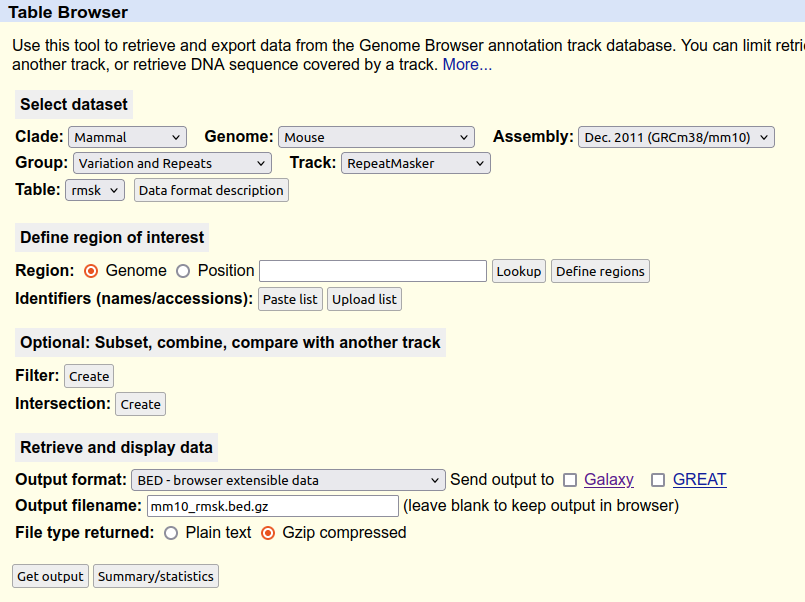

# Run all analyzes from scratch

## What has been done before

The fasta file for mm10 has been downloaded. The STAR index has been generated before.


The conda environments have been created
```bash
conda create -n lastVersion pygenometracks=3.9

conda create -n atac202209 cutadapt=4.1 bowtie2=2.4.5 bedtools=2.30.0 samtools=1.16.1 macs2=2.2.7.1 ucsc-bedgraphtobigwig=377 picard=2.27.4

conda create -n rna202209 cutadapt=1.18 samtools=1.16.1 star=2.7.10a cufflinks=2.2.1 bedtools=2.30.0 ucsc-bedgraphtobigwig=377 sra-tools=3.0.0

conda create -n RNAseq_R_202302 r-base=4.2.2 r-colorspace=2.1_0 bioconductor-deseq2=1.38.0 r-ggplot2=3.4.1 r-pheatmap=1.0.12 r-rcolorbrewer=1.1_3  bioconductor-rtracklayer=1.58.0
```

## Prepare

Run the script to get fasta and gtf

```
bash prepare/01_get_fasta_gtf.sh
```

Run the bowtie2 index for the mutant genome

```
sbatch prepare/02_bowtie2_index.sh $PWD/
```

Prepare all annotations

```
bash prepare/prepare_annotations.sh
```

Get the repeak mask from UCSC:


## b9-b13 evolution (S1A)

Run the R script

```
Rscript b9b13_evolution/biomart_request_b1-b9-b13.R 
```

## ChIPM

Create directory and put fastqs if needed:

```
mkdir -p /scratch/ldelisle/HoxBstudy/ChIPM/fastq/
```

Run bash script

```
sbatch ChIPM/01_ChIP_PE_mm10_HoxB_deli9-13insCBS5-10_del.sh $PWD/ /scratch/ldelisle/HoxBstudy/genomes/
```


## CUT&RUN

Create directory and put fastqs if needed:

```
mkdir -p /scratch/ldelisle/HoxBstudy/CUTandRUN/fastq/
```

Run bash script

```
sbatch CUTandRUN/CUTandRUN_mm10_HoxB_deli9-13insCBS5-10_del.sh $PWD/ /scratch/ldelisle/HoxBstudy/genomes/
```

## RNAseq

Create directory and put fastqs if needed:

```
mkdir -p /scratch/ldelisle/HoxBstudy/RNAseq/fastq/
```

Run bash scripts to get coverage and counts and FPKM

```
sbatch RNAseq/01_RNAseq_PE.sh $PWD/
sbatch RNAseq/01_RNAseq_SR.sh $PWD/
```

Run bash scripts to get merged tables


```
sbatch --chdir $PWD/RNAseq/ RNAseq/03_runRscripts_embryos.sh
sbatch --chdir $PWD/RNAseq/ RNAseq/03_runRscripts_gastruloids.sh
```

Run bash scripts to run DESeq2 on protein coding genes

```
sbatch --chdir $PWD/RNAseq/ RNAseq/04_runRscripts_DESeq2.sh
```

Copy back to github DESeq2 results

```
cp /scratch/ldelisle/HoxBstudy/RNAseq/DESeq2_multi_onlypc/summary_long.txt $PWD/RNAseq/outputs/
cp /scratch/ldelisle/HoxBstudy/RNAseq/DESeq2_multi_onlypc/summary_selected.txt $PWD/RNAseq/outputs/
cp /scratch/ldelisle/HoxBstudy/RNAseq/DESeq2_multi_onlypc/summary.txt $PWD/RNAseq/outputs/
cp /scratch/ldelisle/HoxBstudy/RNAseq/DESeq2_multi_E_onlypc/summary_long.txt $PWD/RNAseq/outputs/summary_long_E.txt
cp /scratch/ldelisle/HoxBstudy/RNAseq/DESeq2_multi_E_onlypc/summary.txt $PWD/RNAseq/outputs/summary_E.txt
gzip $(ls $PWD/RNAseq/outputs/summary*.txt | grep -v selected)
```

Generate plots

```
Rscript RNAseq/plot_FPKM.R
Rscript RNAseq/plot_FPKM_E.R
Rscript RNAseq/plot_DESeq2_E.R
```

## scRNAseq

Everything is described [here](./scRNAseq/README.md)

## tail_analysis

There are 3 R scripts that are all independent.

```
Rscript tail_analysis/plot_caudal_length.R
Rscript tail_analysis/plot_tail_length.R
Rscript tail_analysis/plot_vertebrae_analysis.R
```

## Put everything to submit to GEO

```
cd /scratch/ldelisle/HoxBstudy/
mkdir -p toGEO

mkdir -p toGEO/ChIPM
cp ChIPM/toGEO/* toGEO/ChIPM/
cp ChIPM/fastq/* toGEO/ChIPM/
rm toGEO/ChIPM/ChIPM_RAD21_wt_96h*fastq.gz

mkdir -p toGEO/CUTandRUN
cp CUTandRUN/toGEO/* toGEO/CUTandRUN/
cp CUTandRUN/fastq/* toGEO/CUTandRUN/

mkdir -p toGEO/nCATS
cp nCATS/toGEO/* toGEO/nCATS/
# fast5 called were processed differently

mkdir -p toGEO/RNAseq_embryo
mkdir -p toGEO/RNAseq_gastruloids
cp RNAseq/toGEO/*E[19]* toGEO/RNAseq_embryo/
cp RNAseq/fastq/*E[19]* toGEO/RNAseq_embryo/
cp RNAseq/toGEO/*h_rep* toGEO/RNAseq_gastruloids/
cp RNAseq/fastq/RNAseq_delB* toGEO/RNAseq_gastruloids/
cp RNAseq/toGEO/All*E.txt toGEO/RNAseq_embryo/
cp RNAseq/toGEO/All*[ds].txt toGEO/RNAseq_gastruloids/
gzip toGEO/RNAseq_*/All*
```

## pyGenomeTracks plots

```
bash plots/01_plots.sh
```

